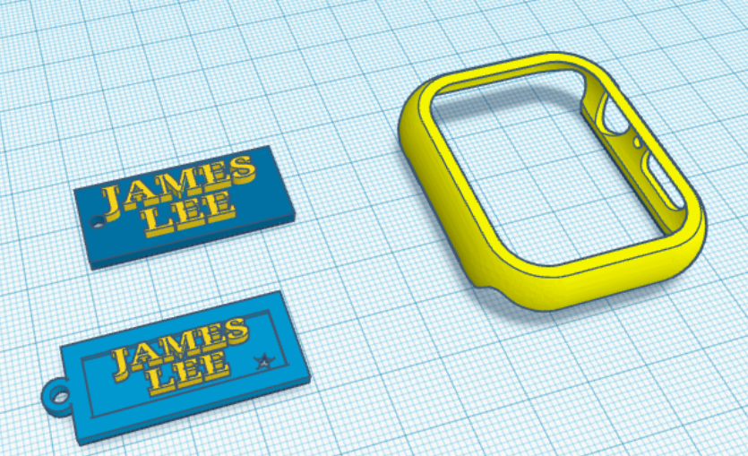

## Hello I'm James Lee
大家好，我電機四乙的李晉丞。我喜歡挑戰自我，往新領域探索，並且也有在台達電子擔任機器視覺演算法開發的實習生。以下是我在課堂上所畫的3D模型。也歡迎各位來加我的Linkedin。

- Hello everyone, I am Jin-Cheng Lee (or James Lee) 
- I am current undergraduate Electrical Engineering student in CYCU.
- I like to challenge myself and explore new areas
And I work as intern in computer vision algorithm development at Delta Inc.
- [James Personal website](https://jinchunglee.github.io/JinChengLeeWeb.github.io/)
- [James Linkedin](https://www.linkedin.com/in/jin-cheng-lee-b70250269/)
- [James Youtube](https://www.youtube.com/@JamesLee-ub4rm)

 

Below is the 3D model I design during class.

